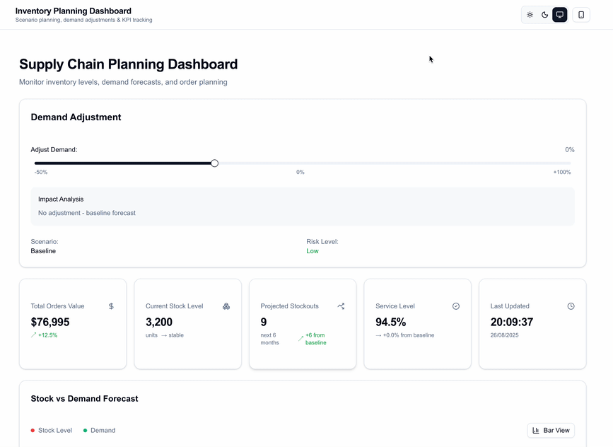

<div align="center">

# Inventory Planning Dashboard

Track inventory KPIs, compare projected demand vs. on‑hand stock, and tweak orders in one place.

Live demo: https://inventory-planning-dashboard.vercel.app/



</div>

## Quick start
Needs Node 20+.

```bash
git clone <repo-url>
cd inventory-planning-dashboard
npm install
npm run dev      # http://localhost:3000
```

Tests:
```bash
npm test
```
Production build:
```bash
npm run build && npm start
```

## Tech stack
- Next.js 15 / React 19 – fast routing + server components for lighter client.
- TypeScript – safer refactors.
- Tailwind CSS v4 + CVA utilities – quick, consistent styling.
- Radix primitives – accessible slider & base components.
- ECharts – solid for mixed time‑series (stock vs demand) and responsive resize.
- next-themes – simple dark/light toggle.
- Jest + Testing Library – behavior‑level component tests.

## Architecture
Feature code lives under `src/dashboard`. Shared low‑level UI primitives in `src/shared/ui`. Error handling: context + boundary + popup for recoverable vs fatal cases. Data is mocked; swapping in a real API later should only touch the hook layer (`use-dashboard-state`).

## Comments
- Deterministic mock data keeps charts realistic but stable for tests.
- Responsive layout: CSS grid/flex + ECharts resize observers.
- Centralized styling variants to avoid class drift.

## Testing
KPI cards, demand adjustment slider, table rendering, chart presence, and error boundary fallback.

## Future improvements
- Simple API layer to swap mocks for real data
- Basic caching (memory + browser) with refresh
- Central data fetch hook; components stay dumb
- Enforce clean imports between feature folders
- Lazy load heavy chart code
- Robust fetch: timeout + retry on network errors
- CI: tests + lint + bundle size check
